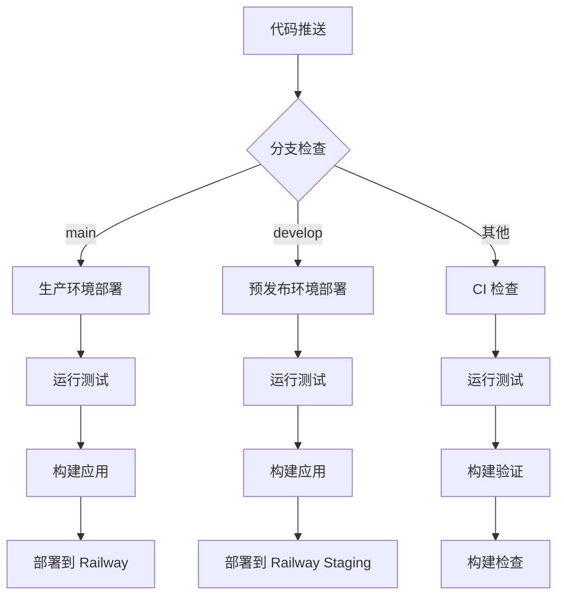

# GitHub Actions 工作流说明

本项目包含以下 GitHub Actions 工作流，用于实现 Railway 的自动化部署和 CI/CD 流程。

## 📋 工作流概览

### 1. 主要部署工作流 (`deploy.yml`)
**文件**: `.github/workflows/deploy.yml`

**触发条件**:
- 推送代码到 `main` 分支 → 部署到生产环境
- 推送代码到 `develop` 分支 → 部署到预发布环境
- 创建或更新 PR → 运行测试和构建

**功能**:
- ✅ 自动化测试 (单元测试 + E2E 测试)
- ✅ 代码质量检查 (ESLint + TypeScript)
- ✅ 内存优化构建
- ✅ 一键部署到 Railway
- ✅ 性能监控 (Lighthouse CI)

### 2. 持续集成工作流 (`ci.yml`)
**文件**: `.github/workflows/ci.yml`

**触发条件**:
- 所有 PR 和推送
- 分支保护检查

**功能**:
- ✅ 代码质量检查
- ✅ 构建验证
- ✅ 安全审计
- ✅ 覆盖率报告

## 🔧 环境配置

### 必需的环境变量
在 GitHub 仓库的 Settings > Secrets and variables > Actions 中配置：

#### Railway 部署所需
```bash
# Railway 访问令牌
RAILWAY_TOKEN=your_railway_token_here

# 生产环境服务 ID
RAILWAY_SERVICE_ID=your_production_service_id

# 预发布环境服务 ID (可选)
RAILWAY_SERVICE_ID_STAGING=your_staging_service_id

# OpenRouter API 密钥
REACT_APP_OPENROUTER_API_KEY=your_openrouter_api_key
```

#### 可选配置
```bash
# CodeCov 令牌 (用于覆盖率报告)
CODECOV_TOKEN=your_codecov_token

# Lighthouse CI 配置
LHCI_GITHUB_APP_TOKEN=your_lhci_token
LHCI_TOKEN=your_lhci_build_token
```

## 🚀 使用指南

### 1. 首次设置
1. **Fork 仓库** 或 **创建新仓库**
2. **配置 Railway**: 在 Railway 控制台创建项目
3. **获取令牌**: 
   - Railway CLI: `railway login` → `railway token`
   - 复制令牌到 GitHub Secrets
4. **获取服务 ID**: `railway status` → 复制 service ID

### 2. 分支策略
```
main      → 生产环境部署
develop   → 预发布环境部署
feature/* → PR 检查和测试
```

### 3. 部署流程


## 📊 监控和日志

### GitHub Actions 状态
- **Actions 标签页**: 查看所有工作流运行状态
- **Pull Request**: 自动显示检查状态
- **仓库首页**: 显示部署状态徽章

### Railway 集成
- **自动部署**: 通过 GitHub Actions 触发
- **回滚**: 支持一键回滚到历史版本
- **监控**: Railway 控制台查看应用状态

## 🔍 故障排除

### 常见问题

#### 1. 部署失败检查清单
- [ ] Railway 令牌是否正确配置
- [ ] 服务 ID 是否匹配
- [ ] 环境变量是否设置
- [ ] 内存限制是否足够

#### 2. 构建失败排查
```bash
# 本地验证构建
npm ci
npm run build:optimized

# 检查构建产物
ls -la build/
```

#### 3. 测试失败处理
```bash
# 本地运行测试
npm run test:ci
npm run test:e2e
```

### 调试技巧
1. **查看 Actions 日志**: GitHub Actions 页面
2. **Railway 日志**: Railway 控制台 → 项目 → 日志
3. **本地验证**: 使用相同的环境变量和命令

## 🎯 最佳实践

### 1. 代码质量
- 所有 PR 必须通过 CI 检查
- 主分支保护规则
- 自动化测试覆盖率

### 2. 部署策略
- 蓝绿部署 (通过 Railway 环境)
- 零停机部署
- 自动回滚机制

### 3. 性能优化
- 构建缓存
- 内存优化构建
- 并行测试执行

## 📈 扩展功能

### 可添加的功能
- [ ] 自动版本标记
- [ ] Slack 通知
- [ ] 部署通知
- [ ] 性能报告
- [ ] 依赖更新自动化

### 环境管理
```bash
# 创建新环境
railway environment create staging

# 配置环境变量
railway variables set REACT_APP_API_KEY=value --environment=staging
```

## 🔗 相关资源

- [Railway 文档](https://docs.railway.app/)
- [GitHub Actions 文档](https://docs.github.com/en/actions)
- [项目部署指南](../docs/RAILWAY_DEPLOYMENT.md)
- [Lighthouse CI 文档](https://github.com/GoogleChrome/lighthouse-ci)

---

**配置完成时间**: 2025年8月26日
**维护者**: telepace 团队