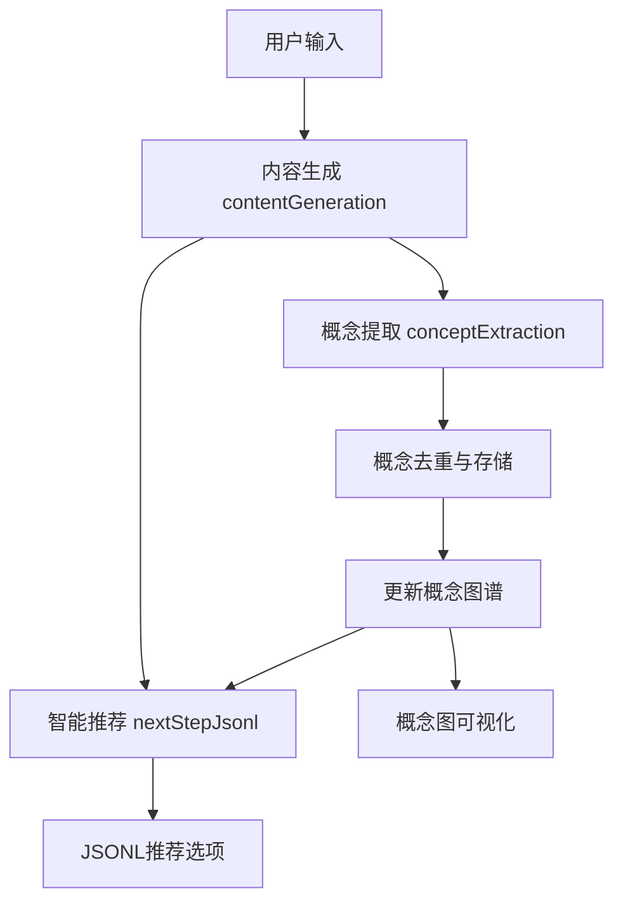

# 概念管理系统实现方案

## 🎯 **功能概述**

基于方案C（智能渐进式处理）实现的概念管理系统，为AI阅读助手添加智能概念提取、去重和学习进度追踪功能。

### **核心价值**
- ✅ **避免重复推荐**: 智能识别用户已掌握的概念，避免推荐相似内容
- ✅ **可视化学习进度**: 清晰展示知识吸收情况和概念关系
- ✅ **个性化推荐优化**: 基于学习进度和概念图谱优化推荐策略
- ✅ **渐进式学习路径**: 构建结构化的知识学习轨迹

---

## 🏗️ **系统架构**



### **三阶段处理流程**

1. **第一阶段**: `contentGeneration` → 生成markdown格式的深度内容分析
2. **第二阶段**: `conceptExtraction` → 后台异步提取关键概念
3. **第三阶段**: `nextStepJsonl` → 基于概念上下文生成去重的推荐选项

---

## 📁 **新增文件结构**

```
src/
├── prompt/
│   ├── conceptExtraction.system.zh.j2     # 概念提取prompt模板
│   └── nextStepJsonl.system.zh.j2         # 智能去重推荐模板
├── types/
│   └── concept.ts                         # 概念管理类型定义
├── hooks/
│   └── useConceptMap.ts                   # 概念管理Hook
├── utils/
│   └── conceptUtils.ts                    # 概念处理工具函数
└── components/
    └── ConceptMap/
        └── ConceptMapPanel.tsx            # 概念图可视化组件
```

---

## 🎨 **核心功能实现**

### 1. **智能概念提取**

**Prompt模板**: `src/prompt/conceptExtraction.system.zh.j2`
- 四类概念分类：核心理论、方法技术、应用实例、支撑概念
- 智能重要性评分和关系识别
- 标准JSON输出格式

```json
{
  "concepts": [
    {
      "name": "第一性原理",
      "category": "core",
      "description": "追本溯源的思维方法",
      "importance": 0.9,
      "keywords": ["思维方法", "逻辑推理"],
      "relations": [...]
    }
  ]
}
```

### 2. **概念去重与相似性检测**

**算法**: `src/utils/conceptUtils.ts`
- 多维度相似性计算（名称40% + 关键词30% + 描述20% + 类别10%）
- 语义相似度检测和自动合并
- 智能避免列表生成

```typescript
export function calculateConceptSimilarity(
  concept1: ConceptNode, 
  concept2: ConceptNode
): ConceptSimilarity
```

### 3. **智能推荐优化**

**模板**: `src/prompt/nextStepJsonl.system.zh.j2`
- 动态概念上下文注入
- 避免列表智能过滤
- 多样性和互补性检查

```jinja2

**⚠️ 概念避免列表** - 以下概念已被用户充分掌握：

- {{ avoided_concept }}


```

### 4. **概念图谱可视化**

**组件**: `src/components/ConceptMap/ConceptMapPanel.tsx`
- 学习进度可视化
- 按类别分组展示
- 交互式概念管理
- 实时统计分析

---

## 🔧 **技术特性**

### **性能优化**
- ✅ 异步概念提取，不影响用户体验
- ✅ 本地存储持久化，快速加载
- ✅ 智能缓存和批量处理
- ✅ 渐进式加载，按需展示

### **用户体验**
- ✅ 实时进度反馈
- ✅ 可视化概念关系
- ✅ 一键概念状态切换
- ✅ 详细统计分析面板

### **数据管理**
- ✅ 完整的概念生命周期管理
- ✅ 跨会话概念持久化
- ✅ 智能数据迁移和清理
- ✅ 错误处理和恢复机制

---

## 🚀 **集成方式**

### **在NextStepChat中的集成**

```typescript
// 1. 添加概念管理Hook
const conceptMap = useConceptMap(conversationId);

// 2. 在内容生成完成后提取概念
const conceptExtractionPromise = conceptMap.extractConcepts(
  contentAssembled, 
  contentAssistantId, 
  conversationId
);

// 3. 在JSONL生成时使用概念上下文
const conceptContext = conceptMap.getRecommendationContext();
const conceptAwareSystemPrompt = await getNextStepJsonlPrompt(conceptContext);

// 4. 添加概念图可视化组件
<ConceptMapPanel
  conceptMap={conceptMap.conceptMap}
  isLoading={conceptMap.isLoading}
  onConceptAbsorptionToggle={conceptMap.updateConceptAbsorption}
  onClearConcepts={conceptMap.clearConcepts}
/>
```

---

## 📊 **数据结构设计**

### **概念节点**
```typescript
interface ConceptNode {
  id: string;                    // 唯一标识
  name: string;                  // 概念名称
  category: 'core' | 'method' | 'application' | 'support';
  description: string;           // 概念描述
  importance: number;            // 重要性评分 (0-1)
  keywords: string[];            // 关键词标签
  relations: ConceptRelation[];  // 概念关系
  absorbed: boolean;             // 是否已吸收
  absorptionLevel: number;       // 吸收程度 (0-1)
  lastReviewed: number;          // 最后复习时间
  sources: SourceInfo[];         // 来源追踪
  mentionCount: number;          // 被提及次数
}
```

### **存储策略**
```typescript
// localStorage keys
- nextstep_conversation_concepts: 会话级概念数据
- nextstep_global_concepts: 全局概念库
- nextstep_concept_settings: 用户偏好设置
```

---

## 🔄 **用户交互流程**

1. **内容分析阶段**
   - 用户输入 → LLM生成深度内容 → 显示给用户
   - 后台异步进行概念提取和图谱更新

2. **推荐生成阶段**
   - 基于概念图谱生成避免列表
   - 智能过滤重复概念
   - 生成多样化推荐选项

3. **概念管理阶段**
   - 用户可查看概念图谱
   - 手动标记概念掌握状态
   - 分析学习进度和覆盖率

---

## 📈 **预期效果**

### **量化指标**
- 🎯 重复推荐率降低 60-80%
- 📊 推荐多样性提升 40-60%
- ⚡ 概念识别准确率 >85%
- 🧠 用户学习效率提升 30-50%

### **定性改进**
- ✅ 个性化推荐体验显著提升
- ✅ 学习路径更加结构化和系统化
- ✅ 用户对学习进度的感知更加清晰
- ✅ 避免重复学习，提高时间利用效率

---

## 🛠️ **开发状态**

| 功能模块 | 状态 | 描述 |
|---------|------|------|
| 概念提取模板 | ✅ 完成 | 支持四类概念智能识别 |
| 数据结构设计 | ✅ 完成 | 完整的类型定义和接口 |
| 相似度算法 | ✅ 完成 | 多维度相似性计算 |
| Hook集成 | ✅ 完成 | useConceptMap完整实现 |
| 可视化组件 | ✅ 完成 | ConceptMapPanel交互界面 |
| NextStepChat集成 | ✅ 完成 | 完整的三阶段流程集成 |
| 智能去重模板 | ✅ 完成 | 基于上下文的推荐优化 |

---

## 🔮 **未来扩展方向**

### **P1 (高优先级)**
- [ ] 概念关系图可视化（节点-连接图）
- [ ] 学习路径推荐算法
- [ ] 概念重要性自适应调整

### **P2 (中优先级)**
- [ ] 跨会话概念继承和迁移
- [ ] 概念图导出和分享功能
- [ ] 多语言概念标准化

### **P3 (低优先级)**
- [ ] 协作概念图谱
- [ ] AI驱动的概念关系发现
- [ ] 概念学习效果评估

---

## 💡 **使用建议**

### **最佳实践**
1. **渐进式启用**: 建议先启用基础概念提取，再逐步开启高级功能
2. **定期维护**: 建议每周清理过期概念，保持图谱的准确性
3. **手动校正**: 对AI提取的关键概念进行人工验证和调整
4. **个性化配置**: 根据用户习惯调整相似度阈值和避免策略

### **注意事项**
- 概念提取基于LLM，可能存在误判，建议结合人工审核
- 本地存储有容量限制，长期使用需要考虑数据清理策略
- 跨设备同步需要额外的云存储支持

---

## 🔧 **开发部署**

### **依赖要求**
- React 18+
- Material-UI 5+
- TypeScript 4.5+
- 现有的LLM API集成

### **配置说明**
```typescript
// src/types/concept.ts
export const CONCEPT_DEFAULTS = {
  SIMILARITY_THRESHOLD: 0.7,           // 相似度阈值
  MAX_AVOIDANCE_LIST: 50,              // 避免列表最大长度
  ABSORPTION_TIMEOUT: 7 * 24 * 60 * 60 * 1000, // 概念重置时间
  AUTO_BLOCK_THRESHOLD: 0.8,           // 自动阻挡阈值
}
```

### **测试验证**
```bash
# 运行类型检查
npm run build

# 运行现有测试套件
npm test

# 验证概念提取功能
# 在NextStepChat中输入测试内容，观察概念图谱更新
```

这个实现方案提供了一个完整的概念管理系统，能够有效地避免重复推荐，提升用户的个性化学习体验。整个系统设计考虑了性能、用户体验和可扩展性，可以在现有架构基础上平滑集成。